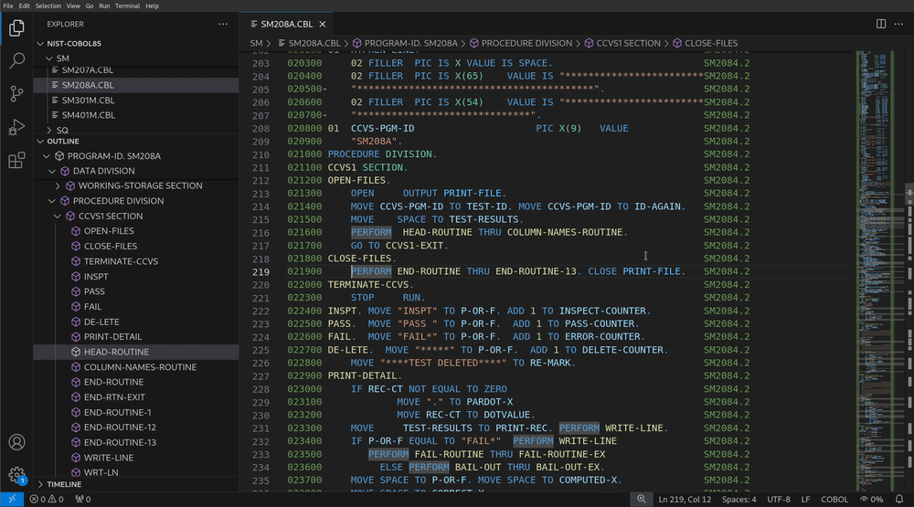
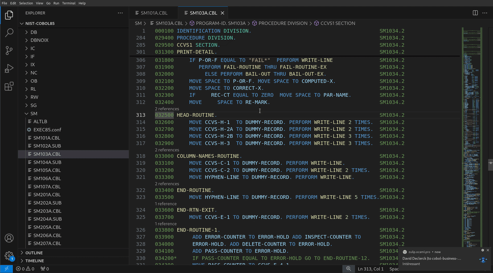
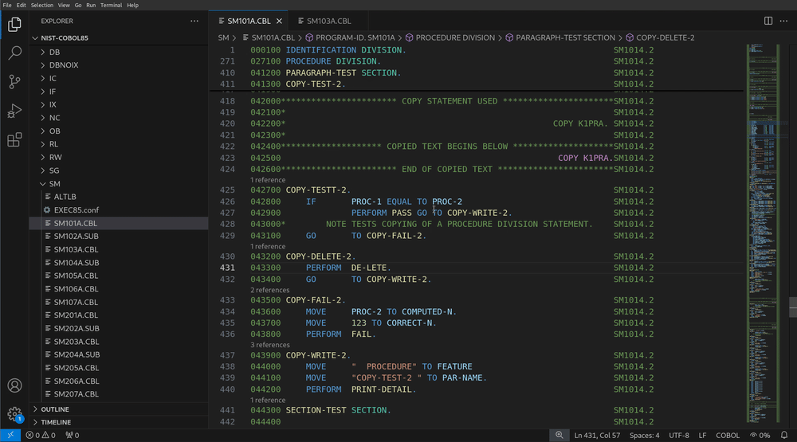

# SuperBOL Studio OSS: A New Platform for COBOL

[](https://github.com/ocamlpro/superbol-studio-oss/actions)
[](https://github.com/ocamlpro/superbol-studio-oss/releases)
[](https://github.com/ocamlpro/superbol-studio-oss/tags)

Visual Studio Code extension for COBOL.

## Getting started

### Installation

You can install SuperBOL Studio OSS either directly from within VS
Code, or via a VSIX file.

#### Installation within VS Code

First, click on the "Extensions" icon in the activity bar on the
left-hand side, or press
<kbd>Ctrl</kbd>+<kbd>Shift</kbd>+<kbd>X</kbd>.  Then, type "superbol"
into the search bar to find it, and press its `Install` button.

You can find further instructions for installing extensions directly
within VS Code on [this
page](https://code.visualstudio.com/docs/editor/extension-marketplace).

#### Installation via a VSIX file

First, download a VSIX file from the
[Marketplace](https://marketplace.visualstudio.com/items?itemName=OCamlPro.SuperBOL)
or [Open VSX](https://open-vsx.org/extension/OCamlPro/SuperBOL).

To install the extension from its VSIX file, open VS Code and go to
the the "Extensions" view.  In the sidebar, click on the three dots
(`⋅⋅⋅`) on the top right-hand side (just above `search`), select
`Install from VSIX…`.  Pick the VSIX file you just downloaded to
install it.

### Editing an existing project

To start using the extension on an existing project, open its folder
in VS Code (`File > Add Folder to Workspace…`).  The extension will
start automatically whenever the folder contains files with usual
COBOL filename extensions (`.cob`, `.cbl`, `.cpy`, `.cbx`).

Then, open the settings (`File > Preferences > Settings`, or
<kbd>Ctrl</kbd>+<kbd>,</kbd>), and start typing "superbol…".  You will
be presented with a screen that resembles:


From here, you can notably configure:

- The COBOL dialect used in the project `"superbol.cobol.dialect"` (see
  [here](https://get-superbol.com/gnucobol/manual/chapter2.html#configuration-options)
  for a documentation on every available dialect).  
  In SuperBOL, the `default` dialect corresponds to GnuCOBOL's default, that supports
  many features from dialects such as `COBOL2014`, `IBM`, `Micro
  Focus` (`mf`), or `GCOS` for instance;

- The default reference source-format `"superbol.cobol.source-format"` (see
  [here](https://get-superbol.com/gnucobol/manual/chapter2.html#source-format)
  for a documentation on the supported source formats).  
  When `auto` is selected, which is the default, SuperBOL (and GnuCOBOL) will
  automagically try to guess whether the source is in `free` or
  `fixed` format.  Other source formats need to be configured
  explicitly.

- The path to copybooks `"superbol.cobol.copybooks"`.  
  To configure this setting, you will need to select `Edit in settings.json`. This is
  a list, where each entry describes an element of the search path where your
  copybooks will be looked for.  Each entry must contain a directory name `dir`,
  and may feature an optional `file-relative` flag.  When absent or set to
  `false`, the latter field indicates that the directory name is
  either absolute, or relative to the root of the project's directory.
  When `file-relative` is `true`, the element of the search path is
  considered relative to the directory where each main source program
  is located.

  

- The copybook extensions `"superbol.cobol.copyexts"`.  
  To configure this setting, you will need to select `Edit in settings.json`. This is
  a list, where each entry describes a file extension if the copybook name cannot
  be found as-is (for example `COPY "mycpy.lib"`).
  In SuperBOL, the `default` option corresponds to GnuCOBOL's default, which
  is `"cpy"`, `"cbl"`, and `"cob"` (searched in upper-case first, and then in
  lower-case).

## Syntax diagnostics

> [!NOTE]
>
> Syntax checks performed by SuperBOL Studio currently cover the
> `COBOL85` dialect, and some constructions of more recent dialects
> supported by GnuCOBOL.  Reporting of such diagnostics is currently
> disabled for dialects other than `COBOL85` to avoid misleading
> developers with false diagnostics about syntax errors.
>
> Reporting can be re-enabled for every dialect by setting the `Force
> Syntax Diagnostics` flag in SuperBOL configuration settings.

## IntelliSense (auto-completion)

When editing a program, you can press <kbd>Ctrl</kbd>+<kbd>Space</kbd>
to obtain suggestions on valid keywords, user-defined words (data item
or paragraph names), and even complete COBOL sentences.  Select an
option with the arrow keys, and press <kbd>Enter</kbd> to insert the
selected suggestion.


> [!NOTE]
> (Temporary limitation)
>
> Suggestions of user-defined words may not comprise symbols that are
> defined in some sections of the data division.  They do not include
> preprocessor-related variables or phrases either.

## Navigation features

### Outline & Breadcrumbs

SuperBOL provides an outline view of your program once you open it,
that you can use to navigate to specific sections or symbols (data
items, paragraphs, etc).  The same information is also shown in the
["breadcrumbs"](https://code.visualstudio.com/docs/editor/editingevolved#_breadcrumbs)
bar, that is usually located above the text edition area.


### Go to Symbol

Symbols shown in Outline and Breadcrumbs views can also be searched
and jumped to by pressing
<kbd>Ctrl</kbd>+<kbd>Shift</kbd>+<kbd>O</kbd>.



### Go to Definition

When you want to locate the definition of a data item name in your
source code, position your cursor on its name, right click, and
select  `Go to Definition` (or press <kbd>F12</kbd>).


> [!NOTE]
> (Temporary limitation)
>
> At the moment, definitions that belong to *some* sections of the
> data division, and some references to data items, are ignored by the
> extension.  They will be covered by the first stable release.

### Peek Definition

To only have a peek at where such a data item defined, you can
position the cursor on its name, right click, and select  `Peek > Peek
Definition` (or press
<kbd>Ctrl</kbd>+<kbd>Shift</kbd>+<kbd>F10</kbd>).  You will then be
presented with a view of the location of the corresponding definition,
including if it lies in a copybook.


### Go to References

If you want to obtain a list of all references to a named data item,
right click and select  `Go to References` (or press
<kbd>Shift</kbd>+<kbd>F12</kbd>).  You will then view the location of
every reference to this item.


> [!NOTE]
> (Temporary limitation)
>
> In addition to limitations mentioned in [Go to
> Definition](#go-to-definition), references that occur in
> `EXEC`/`END-EXEC` blocks are also not taken into account yet.

### Reference Information

The extension shows inline reference information above definitons of
data items and elements of the procedure division.  
The same limitations as for [Go to Definition](#go-to-definition)
apply.

> [!TIP]
> 
> This feature can be turned on or off by tuning the
> `"editor.codeLens"` configuration setting (you can type
> <kbd>Ctrl</kbd>+<kbd>,</kbd> and then `codelens` to change this
> setting).

### Hover to Show Copybooks

Ever wondered what was behind a `COPY` directive?  Just position your
cursor over such a statement, and you will be presented with the
contents of the copybook.


To ensure this works correctly, check your `"superbol.cobol.copybooks"`
and `"superbol.cobol.copyexts"` settings.

### Hover to Show Source Text Replacements

What's more?  You can see the source text that results from
replacement by a `REPLACE` directive in the same way.


## Editing

### Rename Data Items, Sections, and Paragraphs

You can rename any data item by pressing <kbd>F2</kbd> while your
cursor is positioned on one of its references.  The extension will
warn you if a reference to the renamed item appears in a copybook (in
which case the renaming of every reference is not performed).





Sections and paragraphs of the procedure division can also be renamed
in the same way.  
The same limitations as for [Go to References](#go-to-references)
apply to this feature.

## Exploring the Control-flow

Navigating a graphical representation of a COBOL program's
control-flow proves invaluable when it comes to decipher its overall
logic.  To do this, open the command palette (or type
<kbd>Ctrl</kbd>+<kbd>Shift</kbd>+<kbd>P</kbd>), and select `SuperBOL:
Show Control-flow` (you can also right click and select `Show
Control-flow` in the menu).  You are then presented with a list of
portions of program to consider (either the entire program, or
individiual sections): select one element to see the corresponding
CFG.


Various settings are provided to tune the rendering of CFGs.


### CFG as an arc diagram

A rendering of CFGs as arc diagrams is also available.  In this
representation, named sections and paragraphs are laid out vertically,
and arcs show the direction of control-flow between them.


## Debugging

In order to debug a COBOL program, you first need to run a *build
task* with appropriate debug options.  Once this is done, you can
*launch* the compiled program in a debugging session.

> [!NOTE]
>
> We recommend that a version of
> [GnuCOBOL](https://sourceforge.net/projects/gnucobol/) that is at
> least as recent as version 3.2 be available on the system running VS
> Code.  Debug and coverage features respectively assume that
> [gdb](https://sourceware.org/gdb/) and
> [gcov](https://gcc.gnu.org/onlinedocs/gcc/Gcov.html) are installed.
>
> On Windows systems, users may employ dedicated installers that are
> available [here](https://get-superbol.com/software/gnucobol-aio/).
> Linux users may rely on their favorite package manager and install
> `gnucobol`.

### Running a Build Task for Debugging

After having opened the program to debug, select `Terminal >
Run Build Task…`  (<kbd>Ctrl</kbd>+<kbd>Shift</kbd>+<kbd>B</kbd>), and
then `SuperBOL: build (debug)`.


### Launching the Compiled Program for Debugging

If needed, you can place a breakpoint on statements (or paragraph
titles in the procedure division) by clicking on the red dot that
appears when you hover the cursor on the left margin (or with
<kbd>F9</kbd>).  Click on the red dot or press <kbd>F9</kbd> again to
remove a breakpoint.  Then, to launch the program in debug mode,
select `Run > Start Debugging` (<kbd>F5</kbd>).  This will run your
program until a first breakpoint if reached, or to completion.


Once stopped on a breakpoint, you can investigate the values of data
items from the program using the `VARIABLES` panel on the left-hand
side.

Press <kbd>F10</kbd> to step to the next statement, or <kbd>F5</kbd>
again to continue until the next breakpoint, or termination of the
program.

### Customizing Build Tasks

To customize a build task, you can select `Terminal > Configure
Default Build Task…`, and then `SuperBOL: build` or
`SuperBOL: build (debug)` (the latter being the task that is run
whenever you start a debugging session, *e.g* with <kbd>F5</kbd>).

Save the `tasks.json` as shown.  Definitions for this task notably
include a `for-debug` flag, that instructs the compiler to insert
debug annotations into generated executable files, as well as
`extra-args`, that can be edited to pass additional arguments to the
`cobc` compiler.


## Coverage

GnuCOBOL can instrument your programs so they can generate coverage
information at runtime.  To enable this feature, you can set the
`for-coverage` setting to `true` in the `Superbol: build (debug)` task
in your `tasks.json` file (see [Customizing Build
Tasks](#customizing-build-tasks)).  This flag instructs the extension
to pass the `--coverage` flag to the `cobc` compiler.

### Coverage Information

Generated coverage files are in [`gcov`
format](https://gcc.gnu.org/onlinedocs/gcc/Gcov-Intro.html); they are
portable, and you can use them as you would any other coverage file
generated for programs written using other programming languages.

### Highlighting Coverage Information

Coverage data can be shown after the execution of a program that was
compiled to generate this information terminates.  SuperBOL will
display coverage on a line-by-line basis, by highlighting the lines of
your source code using colors that represent their coverage status.
To enable coverage highlighting, you can open the command palette (or
type <kbd>Ctrl</kbd>+<kbd>Shift</kbd>+<kbd>P</kbd>), and select
`SuperBOL: Show Coverage`.  You can also hide the highlighting with
the command `SuperBOL: Hide Coverage`, and update it after
re-executing your program with `SuperBOL: Update Coverage`.


<!-- ## Formatting the source code -->

<!-- > [!NOTE] -->
<!-- > -->
<!-- > Not working on the NIST-COBOL85 suite. -->

## Miscellaneous

### Collaborating with other developers

At this point, the settings for your project are stored and managed by
VS Code.  However, you may plan to collaborate with developers that do
not use this editor.  For instance, they might want to use our mode
for GNU/Emacs, which is located [here](./emacs/).  Then, we advise you
to let SuperBOL Studio store the configuration in a `superbol.toml`
file that will be located at the root of the project.

You can make the extension write your current project configuration
into a `superbol.toml` by entering the command palette (`View >
Command Palette…`, or press
<kbd>Ctrl</kbd>+<kbd>Shift</kbd>+<kbd>P</kbd>), and then selecting the
command `SuperBOL: Write Project Configuration`.


This will save a `superbol.toml` file at the root of each currently
opened project directory.  Such a file will not store any
user-specific settings, so you can now safely put them under source
control.  Extensions dedicated to the edition of TOML files, such as
[`tamasfe.even-better-toml`](https://marketplace.visualstudio.com/items?itemName=tamasfe.even-better-toml),
provide the same level of assistance as when you edit
`.vscode/settings.json`.

> [!TIP]
>
> Install the
> [`OCamlPro.SuperBOL-studio-pack`](https://marketplace.visualstudio.com/items?itemName=OCamlPro.SuperBOL-studio-pack)
> extension to get SuperBOL Studio OSS and `tamasfe.even-better-toml`
> altogether.


### Further documentation

You can check further the documentation on using the extension on
[this page](https://ocamlpro.github.io/superbol-studio-oss/sphinx).

### Mode for GNU/Emacs

You can find [here](./emacs) a mode that allows you to use the
SuperBOL LSP server with GNU/Emacs.

### Using the SuperBOL LSP server with other editors

[This
page](https://github.com/OCamlPro/superbol-studio-oss/wiki/SuperBOL-LSP)
documents how to use our LSP server functionnality with other editors.

### Building from sources

If you build from a clone of the git repository, make sure to update submodules:
```bash
git submodule update --init --recursive
```

You first need to install a few external dependencies to build the LSP
server and the VSCode extension from sources.

1. First, you need to install and initialize
   [opam](https://opam.ocaml.org/);

2. Then you need a recent version[^drom-version] of our build tool
   [drom](https://ocamlpro.github.io/drom/).  The
   easiest way to have it running is via the following command:

   ```bash
   opam pin add https://github.com/OCamlPro/drom.git
   ```

   [^drom-version]: Current version is 0.9.2~dev3 (commit 63a5770).

3. Install [node.js](https://nodejs.org/) (version >=5.2.0) if it
   is not already installed.

4. You can then install all remaining dependencies, and compile the
   LSP server along with the VS Code extension:

   ```bash
   make build-deps vsix-release
   ```

## Resources

* Website: https://ocamlpro.github.io/superbol-studio-oss
* General Documentation: https://ocamlpro.github.io/superbol-studio-oss/sphinx
* Sources: https://github.com/ocamlpro/superbol-studio-oss
